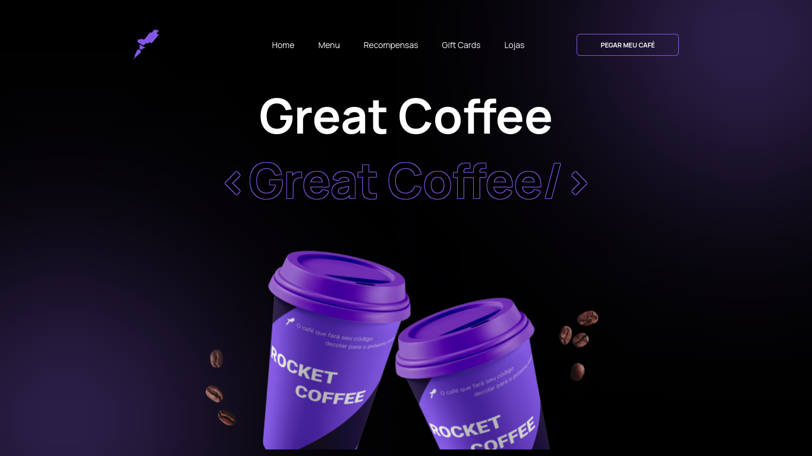

# My Rocket Coffee

Landing page que desenvolvi com React.js e TypeScript, sendo esse um desafio da Rocketseat.

## Tecnologias

- React.js
- TypeScript
- Styled-components

## Como rodar o projeto?

### Requisitos

- Node
- Git

rode o comando abaixo para clonar o projeto em sua máquina  
`git clone https://github.com/GuilhermeAlvarez-00/my-rocketcoffee.git`

após ter clonado, entre na pasta do projeto e rode o comando abaixo para instalar as dependencias do projeto.  
`yarn` ou `npm install`

feito isso, basta rodar o comando `yarn dev` ou `npm run dev`
